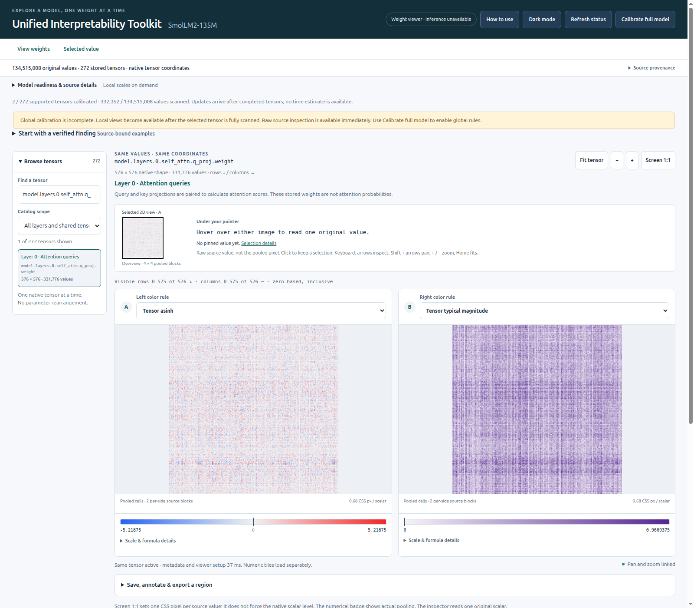
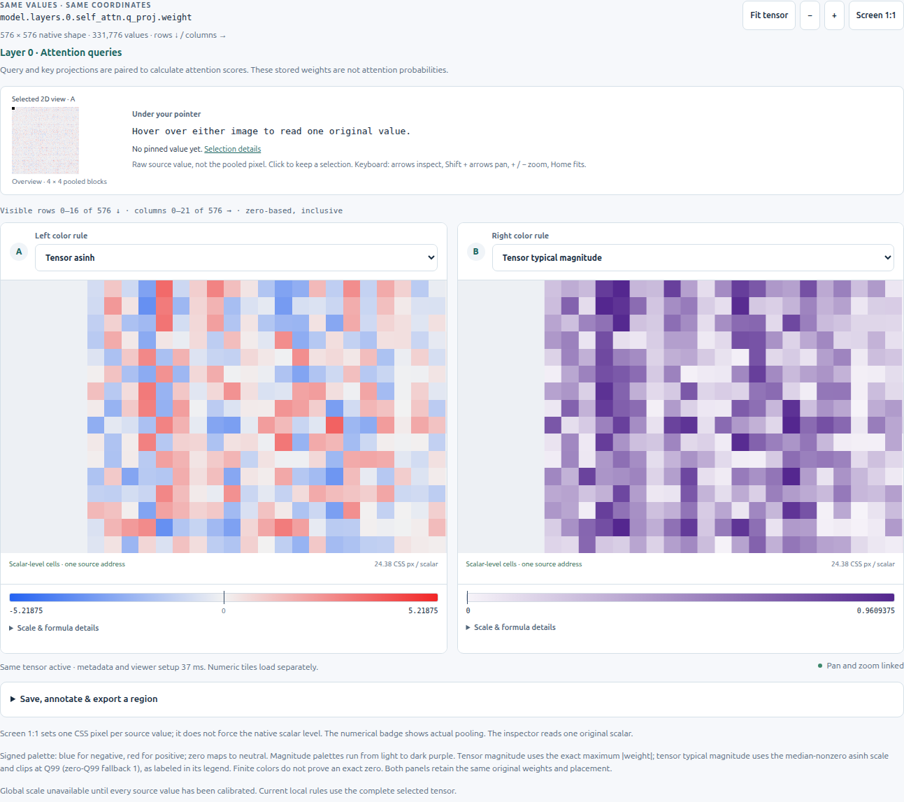

<a name="weight-atlas"></a>

# Unified Interpretability Toolkit

Explore the **stored weights** in a local safetensors checkpoint. Browse tensors as heatmaps, compare numerical patterns under different color rules, zoom into individual weights, and inspect their exact values and source bytes. A bounded Rust reader serves a local browser interface; the basic viewer needs no GPU or Python ML packages.



*Actual SmolLM2-135M weights: `model.layers.0.self_attn.q_proj.weight`, BF16, 576 × 576. Both panels show the same weights and coordinates with different numerical transforms. These are stored parameters, not activations or attention probabilities. [Capture details](docs/screenshots/README.md).*

## What you can do today

- **Explore a checkpoint:** search tensor names, select a layer, and pan or zoom two synchronized views. Look for row/column structure, sign changes, unusually large values, and differences between tensor families.
- **Check what a pattern means numerically:** compare eight color rules, read their scales, and inspect exact decimals, native indices, original bytes, and file offsets. Higher-rank tensors use explicit leading indices.
- **Keep a reproducible observation:** save a source-bound view link, annotate a region, or export up to 256 original values as CSV or NumPy with metadata.
- **Compare compatible checkpoints:** use the separate comparison viewer for A, B, signed `B − A`, or absolute differences. Complete tensor-name sets and native shapes must match; each side may use supported BF16/F16/F32 storage.

Start with the [static-analysis walkthrough](docs/STATIC-ANALYSIS.md), [color semantics](docs/FORMATS.md), or [checkpoint comparison](docs/COMPARISON.md).

## Install and open local weights

The supported runtime is **x86_64 Linux**, with Python 3 (tested with **Python 3.12.3**) and Rust/Cargo (tested with **Rust 1.92.0**). A working native linker is also required. Rust build dependencies are vendored. The build guard requires **5 GiB available RAM** and **25 GiB free disk**. Native default startup requires **3.75 GiB available RAM** and the same disk reserve; these are admission limits, not the model file size.

```bash
git clone https://github.com/jaykobdetar/unified-interpretability-toolkit.git
cd unified-interpretability-toolkit
./run-atlas.sh /path/to/your/safetensors-model --build
```

Open **http://127.0.0.1:8775**. Select a tensor and wait for its calibration and image tiles. Stop the foreground process with **Ctrl-C**. Subsequent launches can omit `--build`:

```bash
./run-atlas.sh /path/to/your/safetensors-model
```

To try the interface without obtaining weights, use `./run-atlas.sh --demo --build`. The included demo has only **26 synthetic BF16 values**; it is separate from the real checkpoint pictured above. Nothing downloads a model or installs packages automatically. The build itself runs offline after cloning.

The viewer reads BF16, F16, and F32 safetensors, including supported sharded checkpoints, without changing the source files. Quantized weights, pickle files, and unsupported tensor shapes remain unavailable; there is no approximate decoding. See [format limits](docs/FORMATS.md).

Use `./run-atlas.sh --help`, `--port 8776` for another free port, or `--check` to validate launch configuration without starting a server. [Launch and troubleshooting](docs/LAUNCH.md) covers saved configuration, cache placement, resource budgets, and prerequisite failures. The launcher `run-atlas.sh`, package/executable `weight-atlas-rust`, and existing CLI/API identifiers retain their names.

## Read the values behind the colors



*Zoomed detail of the same tensor. The resolution badge distinguishes individual source cells from pooled blocks. Signed asinh retains sign; typical magnitude removes sign and clips at its labeled Q99 bound.*

At overview scale, a pixel can summarize multiple weights. The renderer transforms each original value **before** averaging its block. A pale pixel therefore does not establish that the original values are zero. The inspector always reads one original address.

Tensor-specific scales describe one complete tensor and cannot establish absolute magnitude comparisons across tensors. Global rules require explicit full-model calibration. In checkpoint comparison, A/B share one original-value scale and differences use a separate scale. Always keep the tensor, native coordinates, rule, scale, and source identity with an observation.

Stripes and outliers can motivate further investigation. They do not establish a learned concept, head importance, or a causal effect on model behavior.

## Optional and experimental modes

The default viewer performs static inspection and does not generate text. [CPU inference](docs/INFERENCE.md) is a separate, bounded workflow for the pinned SmolLM2-135M source and a qualified Python environment. [Regional analytics](docs/analytics/CONTRACT.md) and the [fixture-scoped whole-slice profile workflow](docs/profile-worker/PROFILE-WORKER-INTERFACE.md) have separate dependencies, source restrictions, and resource limits. General model-family inference and future integrations are not implied by static safetensors support.

## Local operation and privacy

The native reader defaults to one CPU and a 768 MiB address-space limit. [Resource configuration](docs/RESOURCES.md) documents explicit standalone budgets. Linux is qualified; other platforms, arbitrary inference models, GPU inference, and internet hosting are not.

Listeners bind to loopback and retain origin checks. Model paths and metadata can appear in the UI, API, caches, and exports; review them before sharing. Keep weights, private notes/prompts, local configuration, and credentials out of Git. Optional experiment logging is off by default and has separate persistence/consent rules.

## Documentation and development

[Documentation index](docs/README.md) · [Static analysis](docs/STATIC-ANALYSIS.md) · [Launch](docs/LAUNCH.md) · [Architecture](docs/ARCHITECTURE.md) · [API](docs/API-PROGRESSIVE.md) · [Development and testing](docs/DEVELOPMENT.md)

The unified development/CI command checks pinned formatting, static analysis and typing, portable contracts, Rust tests, and smoke/launcher behavior. It needs no model weights or GPU. Real-browser and real-model acceptance are separate guarded checks; portable CI alone does not certify them.

## Licensing

The project is declared Apache-2.0; see [LICENSE](LICENSE) and [third-party notices](THIRD-PARTY-NOTICES.md). Vendored licenses and the retained Qwen model notice remain intact. The Apache appendix is a template, not an attribution of this application to an upstream model author.

Model weights are not included, apart from the generated synthetic fixture. Obtain models under their own licenses and use restrictions; the project license does not replace them.
