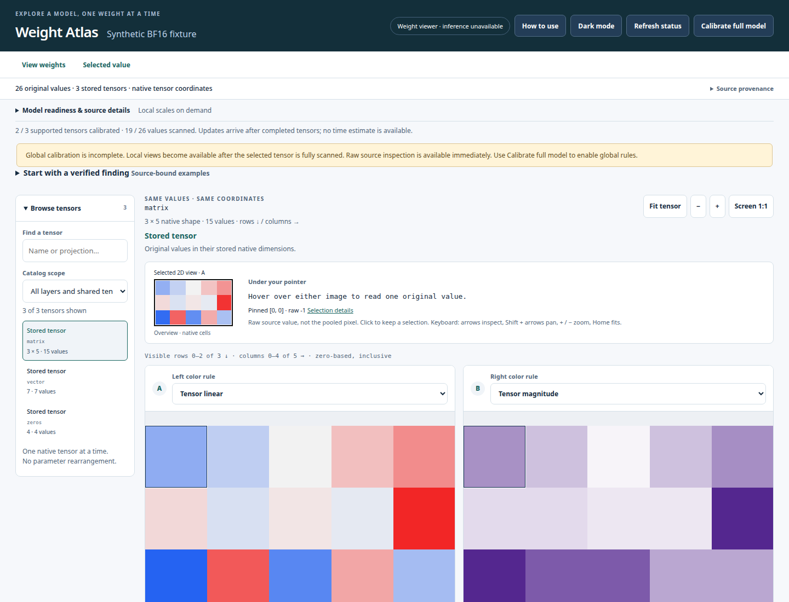
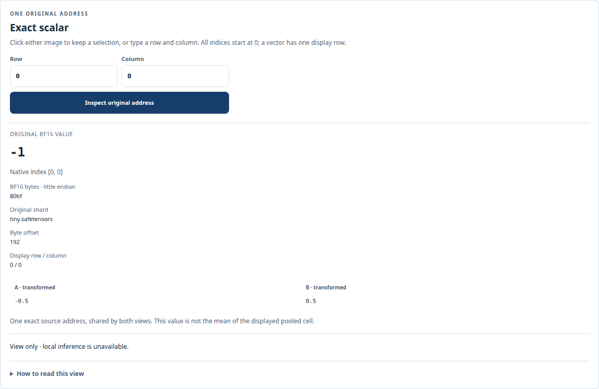

# Weight Atlas

Explore the numbers inside a local safetensors checkpoint. Weight Atlas pairs a bounded Rust reader with a browser viewer: compare color rules at the same coordinates, zoom from block averages to individual weights, and inspect the original value, bytes, and file offset.



*The included fixture contains 26 synthetic BF16 values. This is the actual viewer, not a trained model or an activation map.*

## Try it without a model download

You need **x86_64 Linux**, Python 3, and Rust/Cargo (tested with **Rust 1.92.0**). Build dependencies are vendored. Keep at least **5 GiB available RAM** and **25 GiB free disk** for the existing build guards; the tiny fixture itself is only 244 bytes.

```bash
git clone https://github.com/jaykobdetar/weight-atlas.git
cd weight-atlas
./run-atlas.sh --demo --build
```

Open **http://127.0.0.1:8775**. Select `matrix`, compare the two rules, then enter a row and column in the inspector. Stop with **Ctrl-C**. The first launch builds offline; later launches need only `./run-atlas.sh --demo`. While this repository is private, cloning requires an authorized GitHub account.



*The inspector reports the original signed value even when the selected color rule shows magnitude.*

## Open your own weights

```bash
./run-atlas.sh /path/to/your/safetensors-model
# Use another free port if needed:
./run-atlas.sh /path/to/your/safetensors-model --port 8776
```

The viewer supports BF16, F16, and F32 safetensors, including sharded checkpoints. It reads source files without changing them. No model downloader, account token, Python ML package, or GPU is needed. Unsupported storage stays visibly unavailable; quantized weights and pickle files are not decoded.

Run `./run-atlas.sh --help` for options, or `./run-atlas.sh --demo --check` to check configuration and dependencies without starting a server. For a saved setup, copy [the configuration example](config/viewer.example.json) to `config/viewer.local.json`, edit its paths, then pass `--config config/viewer.local.json`. Local configuration and generated caches are ignored by Git. See [launching and troubleshooting](docs/LAUNCH.md).

## What you can explore

- **Original weights:** synchronized views, eight color rules, exact scalar inspection, explicit higher-rank slices, local bookmarks, and bounded exports.
- **Two checkpoints:** a separate comparison viewer for matching tensor names/shapes, original A/B, and derived signed or absolute differences.
- **Experimental inference:** a separate CPU coordinator for the pinned SmolLM2-135M checkpoint, bounded in-memory edits, paired generation, and selected activation records. **The default viewer does not generate text.**
- **Experimental analysis:** bounded regional analytics and a separately launched, fixture-scoped whole-slice profile workflow. These are not general hosted services.

Colors describe numerical transforms, not concepts, neuron importance, or causal explanations. Nonlinear transforms are applied before block averaging. Tensor-specific scales cannot establish absolute magnitude comparisons across tensors. See [formats and color semantics](docs/FORMATS.md) and [comparison mode](docs/COMPARISON.md).

## Scope and privacy

This is experimental local research software. Linux is the supported runtime; other platforms, arbitrary models, GPU inference, long sessions, and internet hosting are not qualified. The static reader defaults to one CPU and a 768 MiB address-space limit. [Explicit resource budgets](docs/RESOURCES.md) support measured standalone configurations and bounded multicore rendering. Additional inference/analysis modes have their own admission and ownership limits; they may refuse work even when the viewer runs.

Listeners bind to loopback and retain origin checks. Use them locally. Model paths and source metadata can appear in the local UI/API and caches, so review screenshots and exports before sharing. Optional experiment logging is off by default; including prompts requires a separate opt-in, and persistence requires explicit browser-storage consent, a supported user-selected file journal or a manual download. Model files and private prompts do not belong in this repository.

## Documentation and development

[Launch/configuration](docs/LAUNCH.md) · [Architecture](docs/ARCHITECTURE.md) · [API](docs/API-PROGRESSIVE.md) · [Inference](docs/INFERENCE.md) · [Model preparation](docs/MODELS.md) · [Development and testing](docs/DEVELOPMENT.md)

Data workflows: [original region exports](docs/REGION-EXPORT.md), [private experiment archives](docs/EXPERIMENT-ARCHIVES.md), [real Qwen window walkthrough](docs/WORKED-EXAMPLE.md), and [pending bounded qualification](docs/DATA-WORKFLOW-QUALIFICATION.md).

CI runs offline Rust build/tests/clippy, Python and JavaScript syntax checks, portable contract tests, and the tiny synthetic smoke test. It needs no weights, secrets, browser, or GPU. CI does not certify real-model inference or visual correctness.

## Licensing

The project is declared Apache-2.0; see [LICENSE](LICENSE). [Third-party notices](THIRD-PARTY-NOTICES.md), the retained Qwen model license notice, and vendored dependency licenses remain intact. The Apache appendix is a template, not a claim that an upstream model author wrote this application.

Model weights are not included, apart from the generated synthetic test fixture. You are responsible for obtaining models lawfully and complying with each model's license and any use restrictions. The project license does not replace a model license.
