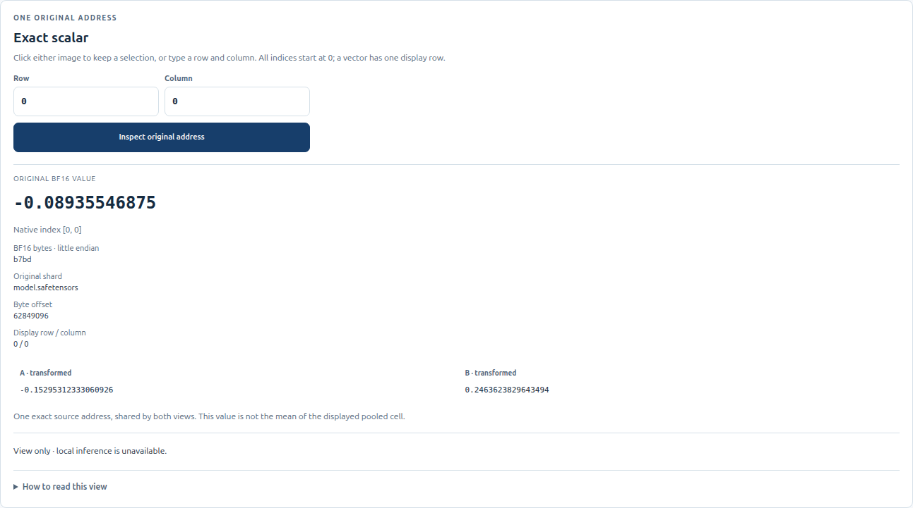

# A practical static weight-analysis workflow

The basic viewer reads stored safetensors values. It does not need to execute the model, tokenize a prompt, or load weights into an inference engine. Use it to document numerical structure and formulate questions for later experiments.

## 1. Open a checkpoint and choose a tensor

Follow [launch instructions](LAUNCH.md), then use **Find a tensor** or **Catalog scope** to narrow the catalog. The native tensor name and shape are the reference: descriptive labels help navigation but do not prove an executable architecture or trusted attention-head layout.

Matrices retain their rows and columns. Vectors occupy one native row. For a higher-rank tensor, explicitly select the leading indices; the last two axes form the view. Unsupported entries keep an unavailable reason. See [formats and bounds](FORMATS.md).

Selecting a supported tensor starts its calibration. Raw scalar inspection can be ready before color rendering. Wait for the image resolution badge to finish loading. **Calibrate full model** is an explicit, potentially much larger scan; it is required for global rules, not for ordinary tensor-local exploration.

## 2. Compare color rules at the same coordinates

Both main-viewer panels show the same original tensor. Their A/B labels identify color views, not separate checkpoints.

| Question | Useful starting view | Interpretation limit |
| --- | --- | --- |
| Where are positive and negative weights? | Tensor linear, then tensor asinh | Blue/red describe sign. Asinh expands smaller magnitudes nonlinearly. |
| Where are the largest absolute values? | Tensor magnitude | A very large outlier can make ordinary values look almost blank. |
| What structure is visible among typical weights? | Tensor typical magnitude or robust 99% | Q99 clipping deliberately saturates extremes; read exact values before comparing them. |
| How do ranks compare within a tensor? | Tensor signed percentile | BF16/F16 only; rank color is not absolute magnitude. |
| How do different tensors compare on one scale? | Global linear/asinh after full calibration | A shared checkpoint scale can hide small values; do not substitute independent tensor scales. |

Read the legend and **Scale & formula details**. [Exact formulas](FORMATS.md) specify bounds, zeros, quantiles, and pooling. A row/column profile seen in a heatmap is an observation about stored numbers; it does not identify a learned feature or establish causal importance.

## 3. Move from an overview to original cells

Use **Fit tensor** for context, then zoom or open **Save, annotate & export a region**, enter inclusive native bounds, and choose **Focus region**. The viewport can extend beyond the requested rectangle to preserve its aspect ratio; the displayed bounds identify what is actually visible.

At coarse zoom, blocks are transformed and then mean-pooled. The resolution badge states whether the image shows pooled blocks or scalar-level cells. **Screen 1:1** describes CSS pixels per source value; consult the badge for the actual numeric level.

Hover to read an original value, click to pin it, or enter a row and column under **Exact scalar**. Inspection reads one native source address, even when its displayed pixel is pooled. The exact decimal, storage dtype, bytes, shard, and byte offset distinguish a real value from its color transform.

*In the pictured checkpoint, `model.layers.0.self_attn.q_proj.weight[0,0]` is exactly −0.08935546875, with little-endian BF16 bytes `b7bd`. Changing the color rule does not change that original value. [Source and capture notes](screenshots/README.md).*

## 4. Save an observation with its scope

Use the region tools to save a view link, attach notes, and export selected original values. A bookmark records source identity and view coordinates/rules; it is not a copy of the checkpoint or a portable authentication certificate. Notes are separate from the link. Source/revision mismatches can make a saved view unavailable on another installation.

[Region exports](REGION-EXPORT.md) read at most 256 native cells. CSV retains decimals and bytes. NumPy export produces an array **and** metadata file; keep both. Values are original and untransformed, with exact BF16-to-F32 widening where needed. An export of a small region is not a full-tensor statistical survey.

A useful observation records the model/revision, native tensor name and shape, slice, inclusive bounds, exact values of interest, rule and scale, and whether an image was pooled. Distinguish a local observation from a complete scan. The [Qwen window walkthrough](WORKED-EXAMPLE.md) illustrates that distinction with retained real-value evidence.

## 5. Compare two supported checkpoints

Open the [dedicated comparison viewer](COMPARISON.md). It requires complete equality of tensor names and exact native shapes; equal parameter counts or model names are insufficient. A/B show originals, while delta is `B − A` and absolute delta is `abs(B − A)`.

A/B use a shared original-value bound. Difference quantities use their own bound, so equal-looking colors across those domains do not mean equal magnitudes. Inspect both originals and the labeled derived difference. The comparison viewer does not expose inference edits.

## Beyond basic inspection

The core viewer supplies heatmaps, exact inspection, bookmarks/notes, and bounded exports. Numeric regional summaries and SVD require the separately launched [BF16 analytics workflow](analytics/CONTRACT.md). Whole-slice row/column profiles have a separate [fixture-scoped worker](profile-worker/PROFILE-WORKER-INTERFACE.md); they are not automatically available for every loaded model.

To test a causal hypothesis, use a supported execution workflow with defined edits and controls. The [pinned CPU inference mode](INFERENCE.md) is separate from static viewing. A supported file format, tensor name, or apparent head boundary does not qualify an arbitrary model for inference.
